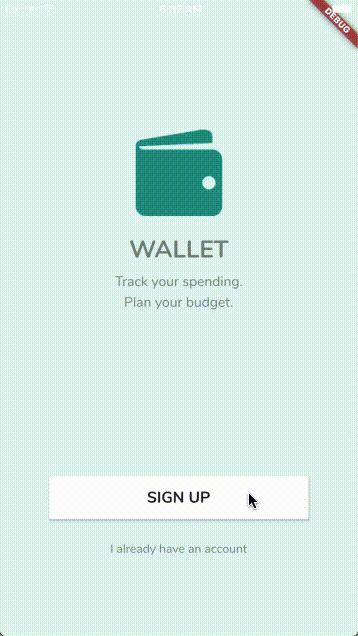
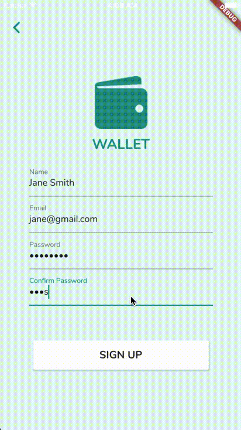
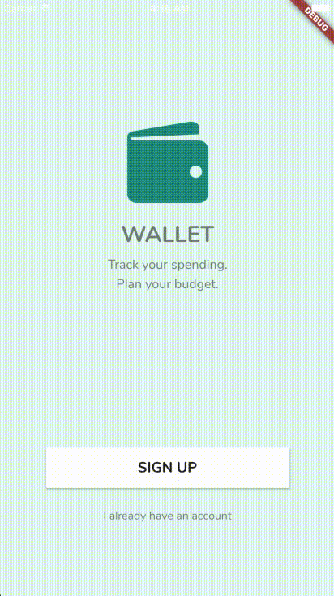
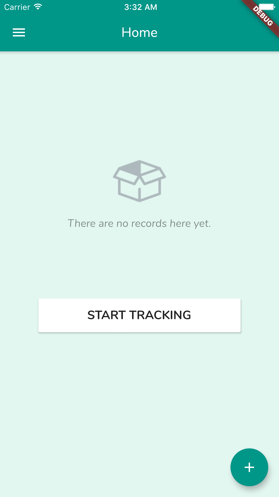
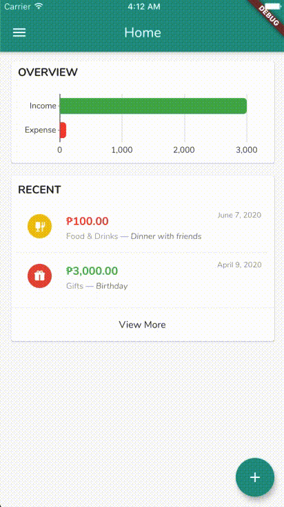
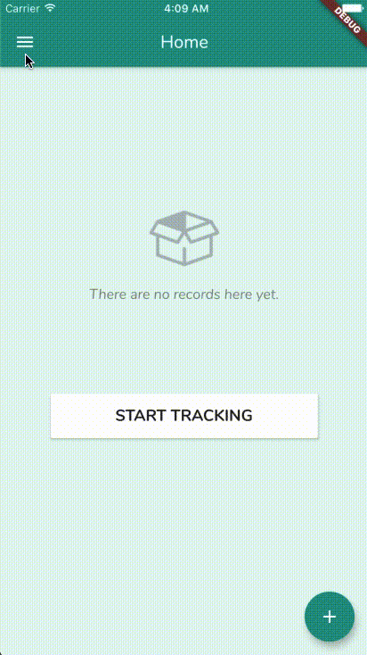
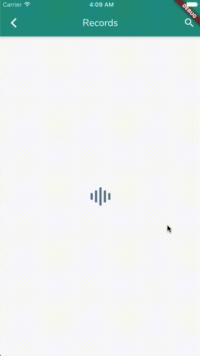
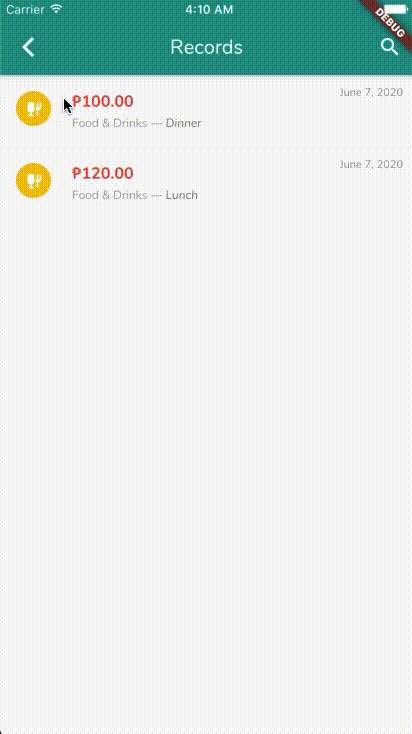
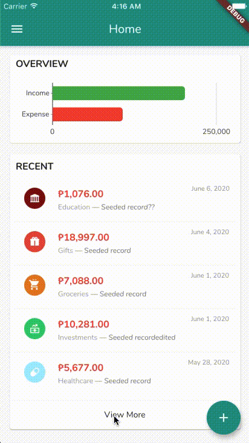
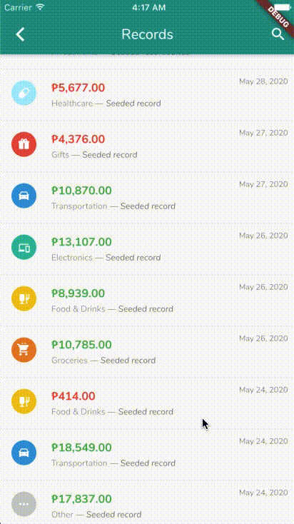

# Table of Contents
- [Onboarding](#onboarding)
- [Registration](#registration)
- [Login](#login)
- [Dashboard Page](#dashboard-page)
  * [Empty view](#empty-view)
  * [Normal view](#normal-view)
- [Log out](#log-out)
- [Create Record](#create-record)
- [Modify an existing record](#modify-an-existing-record)
- [All Records Page](#all-records-page)
  * [Pagination](#pagination)
  * [Search](#search)

### Onboarding

This is the first page that the user will see upon installation of the app. There should be buttons to take them to the registration page (and back), and to the login page (and back).

### Registration

The Registration page asks the user for their name, email, and password, as well as another confirm password field before signing up. The `password` and `confirm password` fields must match. 

Clicking on the Sign Up button should send a Registration API request and redirect the user to the Dashboard page if successful. 

If the sign up failed, ie. a duplicate email, the user should be shown a dialog box and stay on the Registration page.

### Login

The Login page asks the user for their email and password, and these credentials are verified via the Login API. On success, it should redirect the user to the Dashboard page, and show an error dialog otherwise.

When the user has successfully logged in, the app should remember that they have logged in and directly open the Dashboard page when it is next run. This is true for the registration flow as well.

### Dashboard Page

#### Empty view

As seen in the Registration section, if the user has no prior records, the Dashboard page will show a different view. 

#### Normal view

If the user already has records present, the expected view is to show a horizontal bar chart shown the total income and expenses of the user, and 5 of the most recent records made. 

Clicking a record on the list will redirect the user to a page where they can see the details, modify them or delete the record.

### Log out

The user can log out via the menu page on the Dashboard. The user should be redirected to the Onboarding page afterwards, and the app should no longer remember the user's session.

### Create Record

The user can choose to create a record by pressing on the (+) floating action button on the lower right on the screen or by clicking the "Start Tracking" button on the empty view.

The page should show a loading indicator when waiting for the server's response.

On success, the page should go back to either the Dashboard or Records page and the page should refresh to pull new information. Otherwise, an error dialog should be shown.

The Category selection action should be done in a separate page, as shown in the GIF, not in an actionsheet within the page.

### Modify an existing record

The operation of this is similar to that of the Create Page, except for the addition of a Trash button in the app bar. The check button should update the record (not create a new one), and the trash button should delete it.

The page should show a loading indicator when waiting for the server's response.

On success, the page should go back to either the Dashboard or Records page and the page should refresh to pull new information. Otherwise, an error dialog should be shown.

If the user did nothing, then upon clicking the back button, the previous page shall not trigger an update.

### All Records Page

Clicking on the View More button or the Records item in the menu should redirect the user to the All Records page where they will be able to see all the records created.

#### Pagination

The API response is restricted to send out a maximum of 10 items per call. If the user has 50 records, the page will only load the first 10. When the user scrolls to the bottom of the list, the app initiates a fetch for the next page of data until all the data from the server is exhausted. This reduces the amount of data being fetched by the app, especially if the user does not bother to scroll down or is only interested in the first couple of records.

#### Search

On the upper right corner of the page, the user can click on the Search icon and enter a query. The app should implement a search debounce so that it does not keep requesting the server for new data as soon as the TextField's text value changes.

If the only hook the app listens to before making a search request is the `onChanged` callback of the TextField, then quickly typing "hello", will fire 5 separate requests for `h`, `he`, `hel`, `hell`, and `hello`, which is a waste of network resources. 

